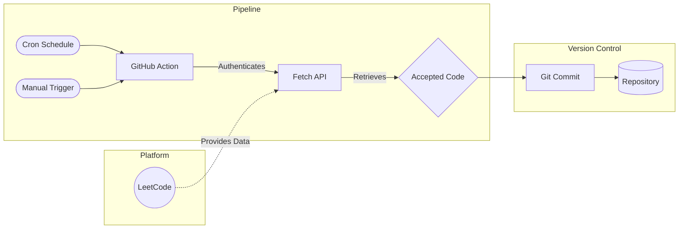

<div align="center">
  
  # LeetCode Journey
  
  *A curated collection of algorithmic solutions, data structures, and problem-solving patterns.*

  [](https://leetcode.com/u/5VPjMsfuqV/)
  [](https://github.com/AyushSingh360/Leetcode/actions)

  <br />
  <br />

  <a href="https://leetcode.com/u/5VPjMsfuqV/">
    
  </a>

</div>

<br />

## Overview

This workspace serves as a personal archive for competitive programming and interview preparation. All accepted submissions are automatically synced from the LeetCode profile to this repository via GitHub Actions, ensuring that progress is continuously documented and version-controlled.

<br />

## Automation Architecture

The synchronization process is fully automated. Below is the architectural flow of how solutions are captured and stored in the repository.



<br />

## Repository Structure

```text
.
├── .github/
│   └── workflows/
│       └── leetcode-sync.yml    # Synchronization automation pipeline
├── leetcode/                    # Auto-populated directory of solutions
└── README.md                    # Project documentation
```

<br />

## Connect

- **LeetCode Profile:** [leetcode.com/u/5VPjMsfuqV](https://leetcode.com/u/5VPjMsfuqV/)
- **GitHub Profile:** [@AyushSingh360](https://github.com/AyushSingh360)

---
<div align="center">
  <p><i>Keep Coding. Keep Improving.</i></p>
</div>
