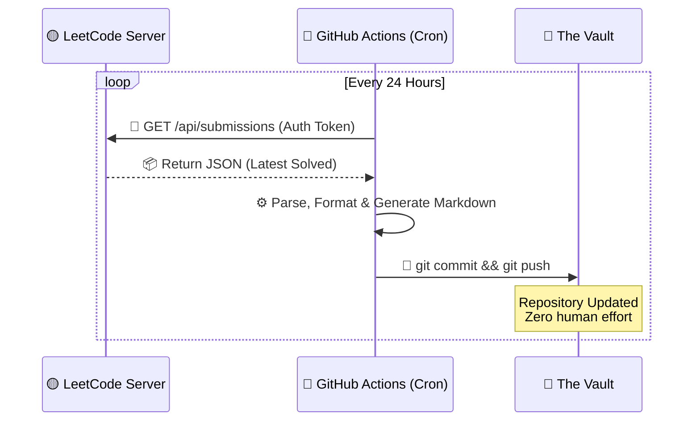
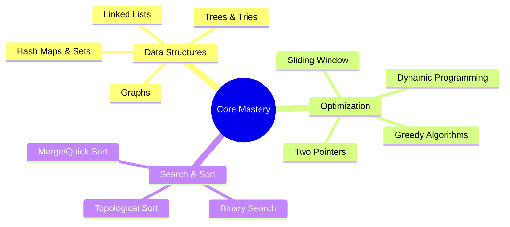
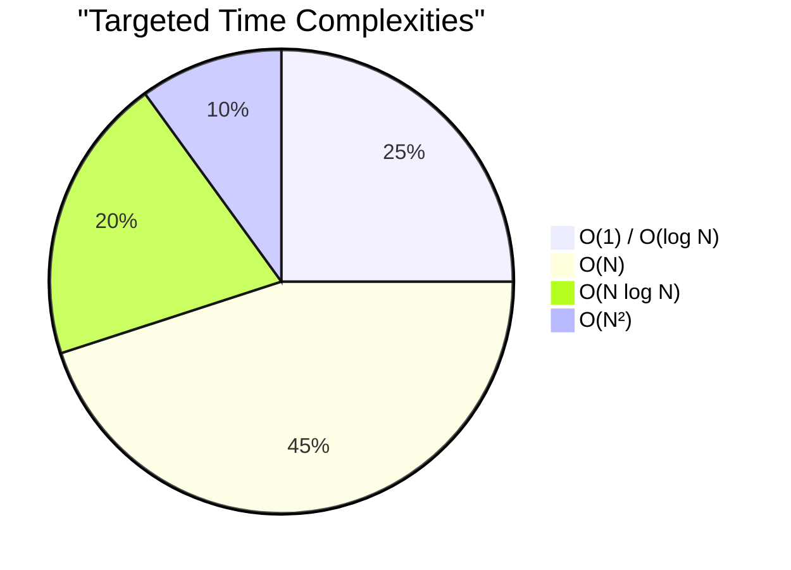
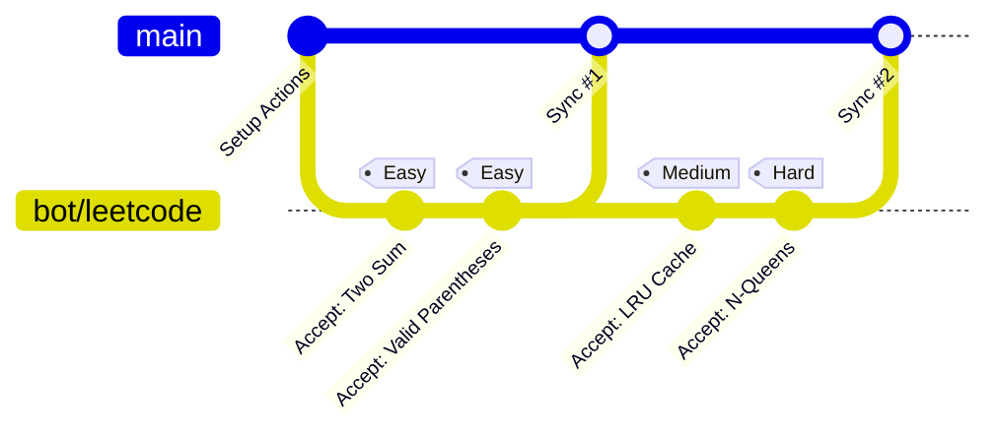

<div align="center">


<a href="https://leetcode.com/u/5VPjMsfuqV/">
  
</a>

<br/>

[](https://leetcode.com/u/5VPjMsfuqV/)
[](https://github.com/AyushSingh360/algorithm-arsenal/actions)
[](#-tech-stack)

<br/>

<a href="https://leetcode.com/u/5VPjMsfuqV/">
  
</a>

</div>

---

### 🚀 ` System.Overview `

Welcome to the **Vault**. This isn't just a repository; it's an automated, self-updating timeline of my algorithmic journey. Every time a problem is conquered on LeetCode, a serverless pipeline instantly pulls the optimal solution, formats it, and injects it directly into this codebase. Zero manual intervention. Maximum efficiency.

<br>

<div align="center">
  
| ⚡ **Speed** | 🧠 **Complexity** | 🏗️ **Architecture** |
| :---: | :---: | :---: |
| Sub-millisecond Execution | O(1) State of Mind | Fully CI/CD Automated |

</div>

<br>

### 🧬 ` Automation.Matrix `



<br>

### 🕸️ ` Algorithmic.Skill_Tree `

A dynamic mapping of the core competencies being trained and cataloged within this repository.



<br>

### 📊 ` Complexity.Distribution `

Conceptual breakdown of optimal solution approaches targeted in this archive.



<br>

### 🌿 ` Version_Control.Topology `

How the automated bot interacts with the Git history upon solving challenges.



<br>

### 🗄️ ` Data.Structures `

The archive is meticulously sorted for rapid O(1) retrieval.

<details open>
<summary><b>📂 Click to Expand Directory Tree</b></summary>
<br>

```bash
root@leetcode-vault:~# tree -L 2
.
├── ⚙️ .github/
│   └── 🤖 workflows/           # CI/CD Sync Engine
├── 🧠 leetcode/                # The Algorithm Core
│   ├── 🟢 Easy/                # Warm-ups & Fundamentals
│   ├── 🟡 Medium/              # Logic & Data Structures
│   └── 🔴 Hard/                # Advanced Optimization
└── 📜 README.md                # System Documentation
```

</details>

<br>

### 💻 ` Tech.Stack `

<table align="center">
  <tr>
    <td align="center" width="96">
      
      <br>C++
    </td>
    <td align="center" width="96">
      
      <br>Python
    </td>
    <td align="center" width="96">
      
      <br>Java
    </td>
    <td align="center" width="96">
      
      <br>JavaScript
    </td>
    <td align="center" width="96">
      
      <br>Actions
    </td>
  </tr>
</table>

<br>

### 📡 `Establish.Connection`

Let's collaborate on system design, competitive programming, or next-gen tech.

<p align="center">
  <a href="https://leetcode.com/u/5VPjMsfuqV/">
    
  </a>
  <a href="https://github.com/AyushSingh360">
    
  </a>
  <a href="https://www.linkedin.com/in/ayushsingh360/">
    
  </a>
</p>

<br>

### 🗂️ ` Solution.Index `

> [!TIP]
> 🔍 **Search by Number:** Press <kbd>Ctrl</kbd> / <kbd>Cmd</kbd> + <kbd>F</kbd> and type the problem number (e.g., `| 1 |` or just `1`) to jump directly to it!

<!-- INDEX_START -->
| # | Problem | Language | Code |
| :--- | :--- | :---: | :---: |
| 1 | Two Sum | `Python` | [View](./leetcode/0001-two-sum) |
| 2 | Add Two Numbers | `Python` | [View](./leetcode/0002-add-two-numbers) |
| 3 | Longest Substring Without Repeating Characters | `Python` | [View](./leetcode/0003-longest-substring-without-repeating-characters) |
| 4 | Median Of Two Sorted Arrays | `Python` | [View](./leetcode/0004-median-of-two-sorted-arrays) |
| 5 | Longest Palindromic Substring | `Python` | [View](./leetcode/0005-longest-palindromic-substring) |
| 6 | Zigzag Conversion | `Python` | [View](./leetcode/0006-zigzag-conversion) |
| 7 | Reverse Integer | `Python` | [View](./leetcode/0007-reverse-integer) |
| 8 | String To Integer Atoi | `Python` | [View](./leetcode/0008-string-to-integer-atoi) |
| 9 | Palindrome Number | `Python` | [View](./leetcode/0009-palindrome-number) |
| 10 | Regular Expression Matching | `Python` | [View](./leetcode/0010-regular-expression-matching) |
| 11 | Container With Most Water | `Python` | [View](./leetcode/0011-container-with-most-water) |
| 12 | Integer To Roman | `Python` | [View](./leetcode/0012-integer-to-roman) |
| 13 | Roman To Integer | `Python` | [View](./leetcode/0013-roman-to-integer) |
| 14 | Longest Common Prefix | `Python` | [View](./leetcode/0014-longest-common-prefix) |
| 15 | 3Sum | `Python` | [View](./leetcode/0015-3sum) |
| 16 | 3Sum Closest | `Python` | [View](./leetcode/0016-3sum-closest) |
| 17 | Letter Combinations Of A Phone Number | `Python` | [View](./leetcode/0017-letter-combinations-of-a-phone-number) |
| 18 | 4Sum | `Python` | [View](./leetcode/0018-4sum) |
| 19 | Remove Nth Node From End Of List | `Python` | [View](./leetcode/0019-remove-nth-node-from-end-of-list) |
| 20 | Valid Parentheses | `Python` | [View](./leetcode/0020-valid-parentheses) |
| 21 | Merge Two Sorted Lists | `Python` | [View](./leetcode/0021-merge-two-sorted-lists) |
| 22 | Generate Parentheses | `Python` | [View](./leetcode/0022-generate-parentheses) |
| 23 | Merge K Sorted Lists | `Python` | [View](./leetcode/0023-merge-k-sorted-lists) |
| 24 | Swap Nodes In Pairs | `Python` | [View](./leetcode/0024-swap-nodes-in-pairs) |
| 25 | Reverse Nodes In K Group | `Python` | [View](./leetcode/0025-reverse-nodes-in-k-group) |
| 26 | Remove Duplicates From Sorted Array | `Python` | [View](./leetcode/0026-remove-duplicates-from-sorted-array) |
| 27 | Remove Element | `Python` | [View](./leetcode/0027-remove-element) |
| 28 | Find The Index Of The First Occurrence In A String | `Python` | [View](./leetcode/0028-find-the-index-of-the-first-occurrence-in-a-string) |
| 29 | Divide Two Integers | `Python` | [View](./leetcode/0029-divide-two-integers) |
| 30 | Substring With Concatenation Of All Words | `Python` | [View](./leetcode/0030-substring-with-concatenation-of-all-words) |
| 31 | Next Permutation | `Python` | [View](./leetcode/0031-next-permutation) |
| 32 | Longest Valid Parentheses | `Python` | [View](./leetcode/0032-longest-valid-parentheses) |
| 33 | Search In Rotated Sorted Array | `Python` | [View](./leetcode/0033-search-in-rotated-sorted-array) |
| 34 | Find First And Last Position Of Element In Sorted Array | `Python` | [View](./leetcode/0034-find-first-and-last-position-of-element-in-sorted-array) |
| 35 | Search Insert Position | `Python` | [View](./leetcode/0035-search-insert-position) |
| 36 | Valid Sudoku | `Python` | [View](./leetcode/0036-valid-sudoku) |
| 37 | Sudoku Solver | `Python` | [View](./leetcode/0037-sudoku-solver) |
| 38 | Count And Say | `Python` | [View](./leetcode/0038-count-and-say) |
| 39 | Combination Sum | `Python` | [View](./leetcode/0039-combination-sum) |
| 40 | Combination Sum Ii | `Python` | [View](./leetcode/0040-combination-sum-ii) |
| 41 | First Missing Positive | `Python` | [View](./leetcode/0041-first-missing-positive) |
| 42 | Trapping Rain Water | `Python` | [View](./leetcode/0042-trapping-rain-water) |
| 43 | Multiply Strings | `Python` | [View](./leetcode/0043-multiply-strings) |
| 44 | Wildcard Matching | `Python` | [View](./leetcode/0044-wildcard-matching) |
| 45 | Jump Game Ii | `Python` | [View](./leetcode/0045-jump-game-ii) |
| 46 | Permutations | `Python` | [View](./leetcode/0046-permutations) |
| 47 | Permutations Ii | `Python` | [View](./leetcode/0047-permutations-ii) |
| 48 | Rotate Image | `Python` | [View](./leetcode/0048-rotate-image) |
| 49 | Group Anagrams | `Python` | [View](./leetcode/0049-group-anagrams) |
| 50 | Powx N | `Python` | [View](./leetcode/0050-powx-n) |
| 51 | N Queens | `Python` | [View](./leetcode/0051-n-queens) |
| 52 | N Queens Ii | `Python` | [View](./leetcode/0052-n-queens-ii) |
| 53 | Maximum Subarray | `Python` | [View](./leetcode/0053-maximum-subarray) |
| 54 | Spiral Matrix | `Python` | [View](./leetcode/0054-spiral-matrix) |
| 55 | Jump Game | `Python` | [View](./leetcode/0055-jump-game) |
| 56 | Merge Intervals | `Python` | [View](./leetcode/0056-merge-intervals) |
| 57 | Insert Interval | `Python` | [View](./leetcode/0057-insert-interval) |
| 58 | Length Of Last Word | `Python` | [View](./leetcode/0058-length-of-last-word) |
| 59 | Spiral Matrix Ii | `Python` | [View](./leetcode/0059-spiral-matrix-ii) |
| 60 | Permutation Sequence | `Python` | [View](./leetcode/0060-permutation-sequence) |
| 61 | Rotate List | `Python` | [View](./leetcode/0061-rotate-list) |
| 62 | Unique Paths | `Python` | [View](./leetcode/0062-unique-paths) |
| 63 | Unique Paths Ii | `Python` | [View](./leetcode/0063-unique-paths-ii) |
| 64 | Minimum Path Sum | `Python` | [View](./leetcode/0064-minimum-path-sum) |
| 66 | Plus One | `Python` | [View](./leetcode/0066-plus-one) |
| 67 | Add Binary | `Python` | [View](./leetcode/0067-add-binary) |
| 69 | Sqrtx | `Python` | [View](./leetcode/0069-sqrtx) |
| 70 | Climbing Stairs | `Python` | [View](./leetcode/0070-climbing-stairs) |
| 71 | Simplify Path | `Python` | [View](./leetcode/0071-simplify-path) |
| 72 | Edit Distance | `Python` | [View](./leetcode/0072-edit-distance) |
| 73 | Set Matrix Zeroes | `Python` | [View](./leetcode/0073-set-matrix-zeroes) |
| 74 | Search A 2D Matrix | `Python` | [View](./leetcode/0074-search-a-2d-matrix) |
| 75 | Sort Colors | `Python` | [View](./leetcode/0075-sort-colors) |
| 77 | Combinations | `Python` | [View](./leetcode/0077-combinations) |
| 78 | Subsets | `Python` | [View](./leetcode/0078-subsets) |
| 79 | Word Search | `Python` | [View](./leetcode/0079-word-search) |
| 80 | Remove Duplicates From Sorted Array Ii | `Python` | [View](./leetcode/0080-remove-duplicates-from-sorted-array-ii) |
| 81 | Search In Rotated Sorted Array Ii | `Python` | [View](./leetcode/0081-search-in-rotated-sorted-array-ii) |
| 82 | Remove Duplicates From Sorted List Ii | `Python` | [View](./leetcode/0082-remove-duplicates-from-sorted-list-ii) |
| 83 | Remove Duplicates From Sorted List | `Python` | [View](./leetcode/0083-remove-duplicates-from-sorted-list) |
| 84 | Largest Rectangle In Histogram | `Python` | [View](./leetcode/0084-largest-rectangle-in-histogram) |
| 85 | Maximal Rectangle | `Python` | [View](./leetcode/0085-maximal-rectangle) |
| 86 | Partition List | `Python` | [View](./leetcode/0086-partition-list) |
| 88 | Merge Sorted Array | `Python` | [View](./leetcode/0088-merge-sorted-array) |
| 89 | Gray Code | `Python` | [View](./leetcode/0089-gray-code) |
| 90 | Subsets Ii | `Python` | [View](./leetcode/0090-subsets-ii) |
| 91 | Decode Ways | `Python` | [View](./leetcode/0091-decode-ways) |
| 92 | Reverse Linked List Ii | `Python` | [View](./leetcode/0092-reverse-linked-list-ii) |
| 93 | Restore Ip Addresses | `Python` | [View](./leetcode/0093-restore-ip-addresses) |
| 94 | Binary Tree Inorder Traversal | `Python` | [View](./leetcode/0094-binary-tree-inorder-traversal) |
| 95 | Unique Binary Search Trees Ii | `Python` | [View](./leetcode/0095-unique-binary-search-trees-ii) |
| 96 | Unique Binary Search Trees | `Python` | [View](./leetcode/0096-unique-binary-search-trees) |
| 97 | Interleaving String | `Python` | [View](./leetcode/0097-interleaving-string) |
| 98 | Validate Binary Search Tree | `Python` | [View](./leetcode/0098-validate-binary-search-tree) |
| 99 | Recover Binary Search Tree | `Python` | [View](./leetcode/0099-recover-binary-search-tree) |
| 100 | Same Tree | `Python` | [View](./leetcode/0100-same-tree) |
| 101 | Symmetric Tree | `Python` | [View](./leetcode/0101-symmetric-tree) |
| 102 | Binary Tree Level Order Traversal | `Python` | [View](./leetcode/0102-binary-tree-level-order-traversal) |
| 103 | Binary Tree Zigzag Level Order Traversal | `Python` | [View](./leetcode/0103-binary-tree-zigzag-level-order-traversal) |
| 104 | Maximum Depth Of Binary Tree | `Python` | [View](./leetcode/0104-maximum-depth-of-binary-tree) |
| 105 | Construct Binary Tree From Preorder And Inorder Traversal | `Python` | [View](./leetcode/0105-construct-binary-tree-from-preorder-and-inorder-traversal) |
| 106 | Construct Binary Tree From Inorder And Postorder Traversal | `Python` | [View](./leetcode/0106-construct-binary-tree-from-inorder-and-postorder-traversal) |
| 107 | Binary Tree Level Order Traversal Ii | `Python` | [View](./leetcode/0107-binary-tree-level-order-traversal-ii) |
| 108 | Convert Sorted Array To Binary Search Tree | `Python` | [View](./leetcode/0108-convert-sorted-array-to-binary-search-tree) |
| 109 | Convert Sorted List To Binary Search Tree | `Python` | [View](./leetcode/0109-convert-sorted-list-to-binary-search-tree) |
| 110 | Balanced Binary Tree | `Python` | [View](./leetcode/0110-balanced-binary-tree) |
| 111 | Minimum Depth Of Binary Tree | `Python` | [View](./leetcode/0111-minimum-depth-of-binary-tree) |
| 112 | Path Sum | `Python` | [View](./leetcode/0112-path-sum) |
| 113 | Path Sum Ii | `Python` | [View](./leetcode/0113-path-sum-ii) |
| 114 | Flatten Binary Tree To Linked List | `Python` | [View](./leetcode/0114-flatten-binary-tree-to-linked-list) |
| 116 | Populating Next Right Pointers In Each Node | `Python` | [View](./leetcode/0116-populating-next-right-pointers-in-each-node) |
| 117 | Populating Next Right Pointers In Each Node Ii | `Python` | [View](./leetcode/0117-populating-next-right-pointers-in-each-node-ii) |
| 118 | Pascals Triangle | `Python` | [View](./leetcode/0118-pascals-triangle) |
| 119 | Pascals Triangle Ii | `Python` | [View](./leetcode/0119-pascals-triangle-ii) |
| 120 | Triangle | `Python` | [View](./leetcode/0120-triangle) |
| 121 | Best Time To Buy And Sell Stock | `Python` | [View](./leetcode/0121-best-time-to-buy-and-sell-stock) |
| 122 | Best Time To Buy And Sell Stock Ii | `Python` | [View](./leetcode/0122-best-time-to-buy-and-sell-stock-ii) |
| 125 | Valid Palindrome | `Python` | [View](./leetcode/0125-valid-palindrome) |
| 126 | Word Ladder Ii | `Python` | [View](./leetcode/0126-word-ladder-ii) |
| 127 | Word Ladder | `Python` | [View](./leetcode/0127-word-ladder) |
| 128 | Longest Consecutive Sequence | `Python` | [View](./leetcode/0128-longest-consecutive-sequence) |
| 129 | Sum Root To Leaf Numbers | `Python` | [View](./leetcode/0129-sum-root-to-leaf-numbers) |
| 130 | Surrounded Regions | `Python` | [View](./leetcode/0130-surrounded-regions) |
| 131 | Palindrome Partitioning | `Python` | [View](./leetcode/0131-palindrome-partitioning) |
| 132 | Palindrome Partitioning Ii | `Python` | [View](./leetcode/0132-palindrome-partitioning-ii) |
| 133 | Clone Graph | `Python` | [View](./leetcode/0133-clone-graph) |
| 134 | Gas Station | `Python` | [View](./leetcode/0134-gas-station) |
| 135 | Candy | `Python` | [View](./leetcode/0135-candy) |
| 136 | Single Number | `Python` | [View](./leetcode/0136-single-number) |
| 137 | Single Number Ii | `Python` | [View](./leetcode/0137-single-number-ii) |
| 138 | Copy List With Random Pointer | `Python` | [View](./leetcode/0138-copy-list-with-random-pointer) |
| 139 | Word Break | `Python` | [View](./leetcode/0139-word-break) |
| 141 | Linked List Cycle | `Python` | [View](./leetcode/0141-linked-list-cycle) |
| 142 | Linked List Cycle Ii | `Python` | [View](./leetcode/0142-linked-list-cycle-ii) |
| 143 | Reorder List | `Python` | [View](./leetcode/0143-reorder-list) |
| 144 | Binary Tree Preorder Traversal | `Python` | [View](./leetcode/0144-binary-tree-preorder-traversal) |
| 145 | Binary Tree Postorder Traversal | `Python` | [View](./leetcode/0145-binary-tree-postorder-traversal) |
| 146 | Lru Cache | `Python` | [View](./leetcode/0146-lru-cache) |
| 147 | Insertion Sort List | `Python` | [View](./leetcode/0147-insertion-sort-list) |
| 148 | Sort List | `Python` | [View](./leetcode/0148-sort-list) |
| 149 | Max Points On A Line | `Python` | [View](./leetcode/0149-max-points-on-a-line) |
| 150 | Evaluate Reverse Polish Notation | `Python` | [View](./leetcode/0150-evaluate-reverse-polish-notation) |
| 151 | Reverse Words In A String | `Python` | [View](./leetcode/0151-reverse-words-in-a-string) |
| 152 | Maximum Product Subarray | `Python` | [View](./leetcode/0152-maximum-product-subarray) |
| 153 | Find Minimum In Rotated Sorted Array | `Python` | [View](./leetcode/0153-find-minimum-in-rotated-sorted-array) |
| 155 | Min Stack | `Python` | [View](./leetcode/0155-min-stack) |
| 160 | Intersection Of Two Linked Lists | `Python` | [View](./leetcode/0160-intersection-of-two-linked-lists) |
| 162 | Find Peak Element | `Python` | [View](./leetcode/0162-find-peak-element) |
| 164 | Maximum Gap | `Python` | [View](./leetcode/0164-maximum-gap) |
| 165 | Compare Version Numbers | `Python` | [View](./leetcode/0165-compare-version-numbers) |
| 166 | Fraction To Recurring Decimal | `Python` | [View](./leetcode/0166-fraction-to-recurring-decimal) |
| 167 | Two Sum Ii   Input Array Is Sorted | `Python` | [View](./leetcode/0167-two-sum-ii---input-array-is-sorted) |
| 168 | Excel Sheet Column Title | `Python` | [View](./leetcode/0168-excel-sheet-column-title) |
| 169 | Majority Element | `Python` | [View](./leetcode/0169-majority-element) |
| 171 | Excel Sheet Column Number | `Python` | [View](./leetcode/0171-excel-sheet-column-number) |
| 172 | Factorial Trailing Zeroes | `Python` | [View](./leetcode/0172-factorial-trailing-zeroes) |
| 173 | Binary Search Tree Iterator | `Python` | [View](./leetcode/0173-binary-search-tree-iterator) |
| 175 | Combine Two Tables | `SQL` | [View](./leetcode/0175-combine-two-tables) |
| 176 | Second Highest Salary | `SQL` | [View](./leetcode/0176-second-highest-salary) |
| 177 | Nth Highest Salary | `SQL` | [View](./leetcode/0177-nth-highest-salary) |
| 178 | Rank Scores | `SQL` | [View](./leetcode/0178-rank-scores) |
| 179 | Largest Number | `Python` | [View](./leetcode/0179-largest-number) |
| 180 | Consecutive Numbers | `SQL` | [View](./leetcode/0180-consecutive-numbers) |
| 181 | Employees Earning More Than Their Managers | `SQL` | [View](./leetcode/0181-employees-earning-more-than-their-managers) |
| 184 | Department Highest Salary | `SQL` | [View](./leetcode/0184-department-highest-salary) |
| 187 | Repeated Dna Sequences | `Python` | [View](./leetcode/0187-repeated-dna-sequences) |
| 189 | Rotate Array | `Python` | [View](./leetcode/0189-rotate-array) |
| 190 | Reverse Bits | `Python` | [View](./leetcode/0190-reverse-bits) |
| 191 | Number Of 1 Bits | `Python` | [View](./leetcode/0191-number-of-1-bits) |
| 198 | House Robber | `Python` | [View](./leetcode/0198-house-robber) |
| 199 | Binary Tree Right Side View | `Python` | [View](./leetcode/0199-binary-tree-right-side-view) |
| 200 | Number Of Islands | `Python` | [View](./leetcode/0200-number-of-islands) |
| 201 | Bitwise And Of Numbers Range | `Python` | [View](./leetcode/0201-bitwise-and-of-numbers-range) |
| 202 | Happy Number | `C++` | [View](./leetcode/0202-happy-number) |
| 203 | Remove Linked List Elements | `Python` | [View](./leetcode/0203-remove-linked-list-elements) |
| 204 | Count Primes | `Python` | [View](./leetcode/0204-count-primes) |
| 205 | Isomorphic Strings | `Python` | [View](./leetcode/0205-isomorphic-strings) |
| 206 | Reverse Linked List | `Python` | [View](./leetcode/0206-reverse-linked-list) |
| 207 | Course Schedule | `Python` | [View](./leetcode/0207-course-schedule) |
| 208 | Implement Trie Prefix Tree | `Python` | [View](./leetcode/0208-implement-trie-prefix-tree) |
| 209 | Minimum Size Subarray Sum | `Python` | [View](./leetcode/0209-minimum-size-subarray-sum) |
| 210 | Course Schedule Ii | `Python` | [View](./leetcode/0210-course-schedule-ii) |
| 211 | Design Add And Search Words Data Structure | `Python` | [View](./leetcode/0211-design-add-and-search-words-data-structure) |
| 213 | House Robber Ii | `Python` | [View](./leetcode/0213-house-robber-ii) |
| 215 | Kth Largest Element In An Array | `Python` | [View](./leetcode/0215-kth-largest-element-in-an-array) |
| 216 | Combination Sum Iii | `Python` | [View](./leetcode/0216-combination-sum-iii) |
| 217 | Contains Duplicate | `Python` | [View](./leetcode/0217-contains-duplicate) |
| 219 | Contains Duplicate Ii | `Python` | [View](./leetcode/0219-contains-duplicate-ii) |
| 221 | Maximal Square | `Python` | [View](./leetcode/0221-maximal-square) |
| 222 | Count Complete Tree Nodes | `Python` | [View](./leetcode/0222-count-complete-tree-nodes) |
| 223 | Rectangle Area | `Python` | [View](./leetcode/0223-rectangle-area) |
| 225 | Implement Stack Using Queues | `Python` | [View](./leetcode/0225-implement-stack-using-queues) |
| 226 | Invert Binary Tree | `Python` | [View](./leetcode/0226-invert-binary-tree) |
| 227 | Basic Calculator Ii | `Python` | [View](./leetcode/0227-basic-calculator-ii) |
| 228 | Summary Ranges | `Python` | [View](./leetcode/0228-summary-ranges) |
| 229 | Majority Element Ii | `Python` | [View](./leetcode/0229-majority-element-ii) |
| 230 | Kth Smallest Element In A Bst | `Python` | [View](./leetcode/0230-kth-smallest-element-in-a-bst) |
| 231 | Power Of Two | `Python` | [View](./leetcode/0231-power-of-two) |
| 232 | Implement Queue Using Stacks | `Python` | [View](./leetcode/0232-implement-queue-using-stacks) |
| 233 | Number Of Digit One | `Python` | [View](./leetcode/0233-number-of-digit-one) |
| 234 | Palindrome Linked List | `Python` | [View](./leetcode/0234-palindrome-linked-list) |
| 235 | Lowest Common Ancestor Of A Binary Search Tree | `Python` | [View](./leetcode/0235-lowest-common-ancestor-of-a-binary-search-tree) |
| 236 | Lowest Common Ancestor Of A Binary Tree | `Python` | [View](./leetcode/0236-lowest-common-ancestor-of-a-binary-tree) |
| 237 | Delete Node In A Linked List | `Python` | [View](./leetcode/0237-delete-node-in-a-linked-list) |
| 238 | Product Of Array Except Self | `Python` | [View](./leetcode/0238-product-of-array-except-self) |
| 239 | Sliding Window Maximum | `Python` | [View](./leetcode/0239-sliding-window-maximum) |
| 240 | Search A 2D Matrix Ii | `Python` | [View](./leetcode/0240-search-a-2d-matrix-ii) |
| 241 | Different Ways To Add Parentheses | `Python` | [View](./leetcode/0241-different-ways-to-add-parentheses) |
| 242 | Valid Anagram | `Python` | [View](./leetcode/0242-valid-anagram) |
| 257 | Binary Tree Paths | `Python` | [View](./leetcode/0257-binary-tree-paths) |
| 258 | Add Digits | `Python` | [View](./leetcode/0258-add-digits) |
| 260 | Single Number Iii | `Python` | [View](./leetcode/0260-single-number-iii) |
| 262 | Trips And Users | `SQL` | [View](./leetcode/0262-trips-and-users) |
| 263 | Ugly Number | `Python` | [View](./leetcode/0263-ugly-number) |
| 264 | Ugly Number Ii | `Python` | [View](./leetcode/0264-ugly-number-ii) |
| 268 | Missing Number | `Python` | [View](./leetcode/0268-missing-number) |
| 274 | H Index | `Python` | [View](./leetcode/0274-h-index) |
| 275 | H Index Ii | `Python` | [View](./leetcode/0275-h-index-ii) |
| 278 | First Bad Version | `Python` | [View](./leetcode/0278-first-bad-version) |
| 279 | Perfect Squares | `Python` | [View](./leetcode/0279-perfect-squares) |
| 283 | Move Zeroes | `Python` | [View](./leetcode/0283-move-zeroes) |
| 284 | Peeking Iterator | `Python` | [View](./leetcode/0284-peeking-iterator) |
| 300 | Longest Increasing Subsequence | `Python` | [View](./leetcode/0300-longest-increasing-subsequence) |
| 316 | Remove Duplicate Letters | `Python` | [View](./leetcode/0316-remove-duplicate-letters) |
| 347 | Top K Frequent Elements | `Python` | [View](./leetcode/0347-top-k-frequent-elements) |
| 371 | Sum Of Two Integers | `Python` | [View](./leetcode/0371-sum-of-two-integers) |
| 380 | Insert Delete Getrandom O1 | `Python` | [View](./leetcode/0380-insert-delete-getrandom-o1) |
| 396 | Rotate Function | `Python` | [View](./leetcode/0396-rotate-function) |
| 401 | Binary Watch | `Python` | [View](./leetcode/0401-binary-watch) |
| 407 | Trapping Rain Water Ii | `Python` | [View](./leetcode/0407-trapping-rain-water-ii) |
| 417 | Pacific Atlantic Water Flow | `Python` | [View](./leetcode/0417-pacific-atlantic-water-flow) |
| 448 | Find All Numbers Disappeared In An Array | `Python` | [View](./leetcode/0448-find-all-numbers-disappeared-in-an-array) |
| 460 | Lfu Cache | `Python` | [View](./leetcode/0460-lfu-cache) |
| 474 | Ones And Zeroes | `Python` | [View](./leetcode/0474-ones-and-zeroes) |
| 485 | Max Consecutive Ones | `Python` | [View](./leetcode/0485-max-consecutive-ones) |
| 560 | Subarray Sum Equals K | `Python` | [View](./leetcode/0560-subarray-sum-equals-k) |
| 584 | Find Customer Referee | `SQL` | [View](./leetcode/0584-find-customer-referee) |
| 585 | Investments In 2016 | `SQL` | [View](./leetcode/0585-investments-in-2016) |
| 586 | Customer Placing The Largest Number Of Orders | `SQL` | [View](./leetcode/0586-customer-placing-the-largest-number-of-orders) |
| 596 | Classes With At Least 5 Students | `SQL` | [View](./leetcode/0596-classes-with-at-least-5-students) |
| 601 | Human Traffic Of Stadium | `SQL` | [View](./leetcode/0601-human-traffic-of-stadium) |
| 608 | Tree Node | `SQL` | [View](./leetcode/0608-tree-node) |
| 620 | Not Boring Movies | `SQL` | [View](./leetcode/0620-not-boring-movies) |
| 636 | Exclusive Time Of Functions | `Python` | [View](./leetcode/0636-exclusive-time-of-functions) |
| 645 | Set Mismatch | `Python` | [View](./leetcode/0645-set-mismatch) |
| 657 | Robot Return To Origin | `Python` | [View](./leetcode/0657-robot-return-to-origin) |
| 693 | Binary Number With Alternating Bits | `Python` | [View](./leetcode/0693-binary-number-with-alternating-bits) |
| 696 | Count Binary Substrings | `Python` | [View](./leetcode/0696-count-binary-substrings) |
| 717 | 1 Bit And 2 Bit Characters | `Python` | [View](./leetcode/0717-1-bit-and-2-bit-characters) |
| 728 | Self Dividing Numbers | `Python` | [View](./leetcode/0728-self-dividing-numbers) |
| 739 | Daily Temperatures | `Python` | [View](./leetcode/0739-daily-temperatures) |
| 759 | Set Intersection Size At Least Two | `Python` | [View](./leetcode/0759-set-intersection-size-at-least-two) |
| 763 | Special Binary String | `Python` | [View](./leetcode/0763-special-binary-string) |
| 767 | Prime Number Of Set Bits In Binary Representation | `Python` | [View](./leetcode/0767-prime-number-of-set-bits-in-binary-representation) |
| 794 | Swim In Rising Water | `Python` | [View](./leetcode/0794-swim-in-rising-water) |
| 804 | Rotated Digits | `Python` | [View](./leetcode/0804-rotated-digits) |
| 812 | Rotate String | `Python` | [View](./leetcode/0812-rotate-string) |
| 815 | Champagne Tower | `Python` | [View](./leetcode/0815-champagne-tower) |
| 830 | Largest Triangle Area | `Python` | [View](./leetcode/0830-largest-triangle-area) |
| 899 | Binary Gap | `Python` | [View](./leetcode/0899-binary-gap) |
| 906 | Walking Robot Simulation | `Python` | [View](./leetcode/0906-walking-robot-simulation) |
| 919 | Projection Area Of 3D Shapes | `Python` | [View](./leetcode/0919-projection-area-of-3d-shapes) |
| 934 | Bitwise Ors Of Subarrays | `Python` | [View](./leetcode/0934-bitwise-ors-of-subarrays) |
| 940 | Fruit Into Baskets | `Python` | [View](./leetcode/0940-fruit-into-baskets) |
| 978 | Valid Mountain Array | `Python` | [View](./leetcode/0978-valid-mountain-array) |
| 1036 | Rotting Oranges | `Python` | [View](./leetcode/1036-rotting-oranges) |
| 1046 | Max Consecutive Ones Iii | `Python` | [View](./leetcode/1046-max-consecutive-ones-iii) |
| 1054 | Complement Of Base 10 Integer | `Python` | [View](./leetcode/1054-complement-of-base-10-integer) |
| 1064 | Smallest Integer Divisible By K | `Python` | [View](./leetcode/1064-smallest-integer-divisible-by-k) |
| 1071 | Binary Prefix Divisible By 5 | `Python` | [View](./leetcode/1071-binary-prefix-divisible-by-5) |
| 1079 | Sum Of Root To Leaf Binary Numbers | `Python` | [View](./leetcode/1079-sum-of-root-to-leaf-binary-numbers) |
| 1135 | Customers Who Bought All Products | `SQL` | [View](./leetcode/1135-customers-who-bought-all-products) |
| 1155 | Product Sales Analysis Iii | `SQL` | [View](./leetcode/1155-product-sales-analysis-iii) |
| 1245 | User Activity For The Past 30 Days I | `SQL` | [View](./leetcode/1245-user-activity-for-the-past-30-days-i) |
| 1305 | Number Of Visible People In A Queue | `Python` | [View](./leetcode/1305-number-of-visible-people-in-a-queue) |
| 1317 | Monthly Transactions I | `SQL` | [View](./leetcode/1317-monthly-transactions-i) |
| 1320 | Remove All Adjacent Duplicates In String Ii | `Python` | [View](./leetcode/1320-remove-all-adjacent-duplicates-in-string-ii) |
| 1371 | Minimum Remove To Make Valid Parentheses | `Python` | [View](./leetcode/1371-minimum-remove-to-make-valid-parentheses) |
| 1388 | Greatest Sum Divisible By Three | `Python` | [View](./leetcode/1388-greatest-sum-divisible-by-three) |
| 1398 | Number Of Ways To Stay In The Same Place After Some Steps | `Python` | [View](./leetcode/1398-number-of-ways-to-stay-in-the-same-place-after-some-steps) |
| 1415 | Students And Examinations | `SQL` | [View](./leetcode/1415-students-and-examinations) |
| 1443 | Minimum Distance To Type A Word Using Two Fingers | `Python` | [View](./leetcode/1443-minimum-distance-to-type-a-word-using-two-fingers) |
| 1458 | Sort Integers By The Number Of 1 Bits | `Python` | [View](./leetcode/1458-sort-integers-by-the-number-of-1-bits) |
| 1460 | Number Of Substrings Containing All Three Characters | `Python` | [View](./leetcode/1460-number-of-substrings-containing-all-three-characters) |
| 1465 | Maximum Product Of Splitted Binary Tree | `Python` | [View](./leetcode/1465-maximum-product-of-splitted-binary-tree) |
| 1480 | Movie Rating | `SQL` | [View](./leetcode/1480-movie-rating) |
| 1482 | How Many Numbers Are Smaller Than The Current Number | `Python` | [View](./leetcode/1482-how-many-numbers-are-smaller-than-the-current-number) |
| 1487 | Cinema Seat Allocation | `Python` | [View](./leetcode/1487-cinema-seat-allocation) |
| 1507 | Check If There Is A Valid Path In A Grid | `Python` | [View](./leetcode/1507-check-if-there-is-a-valid-path-in-a-grid) |
| 1516 | The K Th Lexicographical String Of All Happy Strings Of Length N | `Python` | [View](./leetcode/1516-the-k-th-lexicographical-string-of-all-happy-strings-of-length-n) |
| 1520 | Number Of Steps To Reduce A Number In Binary Representation To One | `Python` | [View](./leetcode/1520-number-of-steps-to-reduce-a-number-in-binary-representation-to-one) |
| 1548 | Check If All 1S Are At Least Length K Places Away | `Python` | [View](./leetcode/1548-check-if-all-1s-are-at-least-length-k-places-away) |
| 1552 | Build An Array With Stack Operations | `Python` | [View](./leetcode/1552-build-an-array-with-stack-operations) |
| 1557 | Check If A String Contains All Binary Codes Of Size K | `Python` | [View](./leetcode/1557-check-if-a-string-contains-all-binary-codes-of-size-k) |
| 1569 | Max Dot Product Of Two Subsequences | `Python` | [View](./leetcode/1569-max-dot-product-of-two-subsequences) |
| 1570 | Final Prices With A Special Discount In A Shop | `Python` | [View](./leetcode/1570-final-prices-with-a-special-discount-in-a-shop) |
| 1580 | Shuffle The Array | `Python` | [View](./leetcode/1580-shuffle-the-array) |
| 1612 | Avoid Flood In The City | `Python` | [View](./leetcode/1612-avoid-flood-in-the-city) |
| 1626 | Can Make Arithmetic Progression From Sequence | `Python` | [View](./leetcode/1626-can-make-arithmetic-progression-from-sequence) |
| 1630 | Count Odd Numbers In An Interval Range | `Python` | [View](./leetcode/1630-count-odd-numbers-in-an-interval-range) |
| 1636 | Number Of Substrings With Only 1S | `Python` | [View](./leetcode/1636-number-of-substrings-with-only-1s) |
| 1658 | Minimum Swaps To Arrange A Binary Grid | `Python` | [View](./leetcode/1658-minimum-swaps-to-arrange-a-binary-grid) |
| 1663 | Detect Cycles In 2D Grid | `Python` | [View](./leetcode/1663-detect-cycles-in-2d-grid) |
| 1667 | Find Kth Bit In Nth Binary String | `Python` | [View](./leetcode/1667-find-kth-bit-in-nth-binary-string) |
| 1694 | Make Sum Divisible By P | `Python` | [View](./leetcode/1694-make-sum-divisible-by-p) |
| 1704 | Special Positions In A Binary Matrix | `Python` | [View](./leetcode/1704-special-positions-in-a-binary-matrix) |
| 1716 | Maximum Non Negative Product In A Matrix | `Python` | [View](./leetcode/1716-maximum-non-negative-product-in-a-matrix) |
| 1800 | Concatenation Of Consecutive Binary Numbers | `Python` | [View](./leetcode/1800-concatenation-of-consecutive-binary-numbers) |
| 1807 | Partitioning Into Minimum Number Of Deci Binary Numbers | `Python` | [View](./leetcode/1807-partitioning-into-minimum-number-of-deci-binary-numbers) |
| 1840 | Minimize Hamming Distance After Swap Operations | `Python` | [View](./leetcode/1840-minimize-hamming-distance-after-swap-operations) |
| 1845 | Largest Submatrix With Rearrangements | `Python` | [View](./leetcode/1845-largest-submatrix-with-rearrangements) |
| 1884 | Minimum Changes To Make Alternating Binary String | `Python` | [View](./leetcode/1884-minimum-changes-to-make-alternating-binary-string) |
| 1910 | Check If Binary String Has At Most One Segment Of Ones | `Python` | [View](./leetcode/1910-check-if-binary-string-has-at-most-one-segment-of-ones) |
| 1972 | Rotating The Box | `Python` | [View](./leetcode/1972-rotating-the-box) |
| 1975 | Minimum Distance To The Target Element | `Python` | [View](./leetcode/1975-minimum-distance-to-the-target-element) |
| 1984 | Maximum Distance Between A Pair Of Values | `Python` | [View](./leetcode/1984-maximum-distance-between-a-pair-of-values) |
| 1990 | Get Biggest Three Rhombus Sums In A Grid | `Python` | [View](./leetcode/1990-get-biggest-three-rhombus-sums-in-a-grid) |
| 1996 | Number Of Ways To Rearrange Sticks With K Sticks Visible | `Python` | [View](./leetcode/1996-number-of-ways-to-rearrange-sticks-with-k-sticks-visible) |
| 2015 | Determine Whether Matrix Can Be Obtained By Rotation | `Python` | [View](./leetcode/2015-determine-whether-matrix-can-be-obtained-by-rotation) |
| 2017 | Minimum Number Of Flips To Make The Binary String Alternating | `Python` | [View](./leetcode/2017-minimum-number-of-flips-to-make-the-binary-string-alternating) |
| 2037 | Count Square Sum Triples | `Python` | [View](./leetcode/2037-count-square-sum-triples) |
| 2043 | Cyclically Rotating A Grid | `Python` | [View](./leetcode/2043-cyclically-rotating-a-grid) |
| 2058 | Concatenation Of Array | `Python` | [View](./leetcode/2058-concatenation-of-array) |
| 2059 | Unique Length 3 Palindromic Subsequences | `Python` | [View](./leetcode/2059-unique-length-3-palindromic-subsequences) |
| 2107 | Find Unique Binary String | `Python` | [View](./leetcode/2107-find-unique-binary-string) |
| 2125 | Gcd Sort Of An Array | `Python` | [View](./leetcode/2125-gcd-sort-of-an-array) |
| 2160 | Minimum Operations To Make A Uni Value Grid | `Python` | [View](./leetcode/2160-minimum-operations-to-make-a-uni-value-grid) |
| 2170 | Count Number Of Maximum Bitwise Or Subsets | `Python` | [View](./leetcode/2170-count-number-of-maximum-bitwise-or-subsets) |
| 2174 | Next Greater Numerically Balanced Number | `Python` | [View](./leetcode/2174-next-greater-numerically-balanced-number) |
| 2178 | Walking Robot Simulation Ii | `Python` | [View](./leetcode/2178-walking-robot-simulation-ii) |
| 2197 | Decode The Slanted Ciphertext | `Python` | [View](./leetcode/2197-decode-the-slanted-ciphertext) |
| 2199 | Two Furthest Houses With Different Colors | `Python` | [View](./leetcode/2199-two-furthest-houses-with-different-colors) |
| 2229 | Maximum Fruits Harvested After At Most K Steps | `Python` | [View](./leetcode/2229-maximum-fruits-harvested-after-at-most-k-steps) |
| 2263 | Maximum Running Time Of N Computers | `Python` | [View](./leetcode/2263-maximum-running-time-of-n-computers) |
| 2265 | Partition Array According To Given Pivot | `Python` | [View](./leetcode/2265-partition-array-according-to-given-pivot) |
| 2271 | Rearrange Array Elements By Sign | `Python` | [View](./leetcode/2271-rearrange-array-elements-by-sign) |
| 2274 | Keep Multiplying Found Values By Two | `Python` | [View](./leetcode/2274-keep-multiplying-found-values-by-two) |
| 2316 | Count Hills And Valleys In An Array | `Python` | [View](./leetcode/2316-count-hills-and-valleys-in-an-array) |
| 2317 | Count Collisions On A Road | `Python` | [View](./leetcode/2317-count-collisions-on-a-road) |
| 2392 | Successful Pairs Of Spells And Potions | `Python` | [View](./leetcode/2392-successful-pairs-of-spells-and-potions) |
| 2463 | Minimum Recolors To Get K Consecutive Black Blocks | `Python` | [View](./leetcode/2463-minimum-recolors-to-get-k-consecutive-black-blocks) |
| 2498 | Smallest Subarrays With Maximum Bitwise Or | `Python` | [View](./leetcode/2498-smallest-subarrays-with-maximum-bitwise-or) |
| 2503 | Longest Subarray With Maximum Bitwise And | `Python` | [View](./leetcode/2503-longest-subarray-with-maximum-bitwise-and) |
| 2550 | Words Within Two Edits Of Dictionary | `Python` | [View](./leetcode/2550-words-within-two-edits-of-dictionary) |
| 2554 | Minimum Total Distance Traveled | `Python` | [View](./leetcode/2554-minimum-total-distance-traveled) |
| 2559 | Maximum Number Of Non Overlapping Palindrome Substrings | `Python` | [View](./leetcode/2559-maximum-number-of-non-overlapping-palindrome-substrings) |
| 2571 | Find The Pivot Integer | `Python` | [View](./leetcode/2571-find-the-pivot-integer) |
| 2574 | Count Subarrays With Median K | `Python` | [View](./leetcode/2574-count-subarrays-with-median-k) |
| 2598 | Shortest Distance To Target String In A Circular Array | `Python` | [View](./leetcode/2598-shortest-distance-to-target-string-in-a-circular-array) |
| 2610 | Closest Prime Numbers In Range | `Python` | [View](./leetcode/2610-closest-prime-numbers-in-range) |
| 2625 | Increment Submatrices By One | `Python` | [View](./leetcode/2625-increment-submatrices-by-one) |
| 2689 | Rearranging Fruits | `Python` | [View](./leetcode/2689-rearranging-fruits) |
| 2707 | Merge Two 2D Arrays By Summing Values | `Python` | [View](./leetcode/2707-merge-two-2d-arrays-by-summing-values) |
| 2708 | Find The String With Lcp | `Python` | [View](./leetcode/2708-find-the-string-with-lcp) |
| 2710 | Minimum Operations To Reduce An Integer To 0 | `Python` | [View](./leetcode/2710-minimum-operations-to-reduce-an-integer-to-0) |
| 2721 | Sum Of Distances | `Python` | [View](./leetcode/2721-sum-of-distances) |
| 2731 | Memoize | `JavaScript` | [View](./leetcode/2731-memoize) |
| 2732 | Counter | `JavaScript` | [View](./leetcode/2732-counter) |
| 2733 | Sleep | `JavaScript` | [View](./leetcode/2733-sleep) |
| 2734 | Array Prototype Last | `JavaScript` | [View](./leetcode/2734-array-prototype-last) |
| 2741 | Function Composition | `JavaScript` | [View](./leetcode/2741-function-composition) |
| 2742 | Group By | `JavaScript` | [View](./leetcode/2742-group-by) |
| 2743 | Debounce | `JavaScript` | [View](./leetcode/2743-debounce) |
| 2746 | Filter Elements From Array | `JavaScript` | [View](./leetcode/2746-filter-elements-from-array) |
| 2747 | Apply Transform Over Each Element In Array | `JavaScript` | [View](./leetcode/2747-apply-transform-over-each-element-in-array) |
| 2749 | Promise Time Limit | `JavaScript` | [View](./leetcode/2749-promise-time-limit) |
| 2753 | Minimum Number Of Operations To Make All Array Elements Equal To 1 | `Python` | [View](./leetcode/2753-minimum-number-of-operations-to-make-all-array-elements-equal-to-1) |
| 2759 | Flatten Deeply Nested Array | `JavaScript` | [View](./leetcode/2759-flatten-deeply-nested-array) |
| 2761 | Array Reduce Transformation | `JavaScript` | [View](./leetcode/2761-array-reduce-transformation) |
| 2762 | Cache With Time Limit | `JavaScript` | [View](./leetcode/2762-cache-with-time-limit) |
| 2779 | Number Of Adjacent Elements With The Same Color | `Python` | [View](./leetcode/2779-number-of-adjacent-elements-with-the-same-color) |
| 2789 | Counter Ii | `JavaScript` | [View](./leetcode/2789-counter-ii) |
| 2796 | Allow One Function Call | `JavaScript` | [View](./leetcode/2796-allow-one-function-call) |
| 2797 | Event Emitter | `TypeScript` | [View](./leetcode/2797-event-emitter) |
| 2798 | Chunk Array | `JavaScript` | [View](./leetcode/2798-chunk-array) |
| 2804 | Compact Object | `TypeScript` | [View](./leetcode/2804-compact-object) |
| 2805 | Array Wrapper | `TypeScript` | [View](./leetcode/2805-array-wrapper) |
| 2807 | Execute Asynchronous Functions In Parallel | `JavaScript` | [View](./leetcode/2807-execute-asynchronous-functions-in-parallel) |
| 2809 | Create Hello World Function | `TypeScript`, `JavaScript` | [View](./leetcode/2809-create-hello-world-function) |
| 2813 | To Be Or Not To Be | `JavaScript` | [View](./leetcode/2813-to-be-or-not-to-be) |
| 2820 | Return Length Of Arguments Passed | `JavaScript` | [View](./leetcode/2820-return-length-of-arguments-passed) |
| 2821 | Timeout Cancellation | `JavaScript` | [View](./leetcode/2821-timeout-cancellation) |
| 2846 | Robot Collisions | `Python` | [View](./leetcode/2846-robot-collisions) |
| 2855 | Maximum Number Of Jumps To Reach The Last Index | `Python` | [View](./leetcode/2855-maximum-number-of-jumps-to-reach-the-last-index) |
| 2858 | Join Two Arrays By Id | `JavaScript` | [View](./leetcode/2858-join-two-arrays-by-id) |
| 2859 | Add Two Promises | `JavaScript` | [View](./leetcode/2859-add-two-promises) |
| 2860 | Sort By | `JavaScript` | [View](./leetcode/2860-sort-by) |
| 2862 | Interval Cancellation | `JavaScript` | [View](./leetcode/2862-interval-cancellation) |
| 2863 | Calculator With Method Chaining | `TypeScript` | [View](./leetcode/2863-calculator-with-method-chaining) |
| 2864 | Is Object Empty | `JavaScript` | [View](./leetcode/2864-is-object-empty) |
| 2905 | Count Paths That Can Form A Palindrome In A Tree | `Python` | [View](./leetcode/2905-count-paths-that-can-form-a-palindrome-in-a-tree) |
| 2978 | Check If Strings Can Be Made Equal With Operations Ii | `Python` | [View](./leetcode/2978-check-if-strings-can-be-made-equal-with-operations-ii) |
| 2999 | Check If Strings Can Be Made Equal With Operations I | `Python` | [View](./leetcode/2999-check-if-strings-can-be-made-equal-with-operations-i) |
| 3019 | Furthest Point From Origin | `Python` | [View](./leetcode/3019-furthest-point-from-origin) |
| 3031 | Construct Product Matrix | `Python` | [View](./leetcode/3031-construct-product-matrix) |
| 3105 | Minimum Edge Reversals So Every Node Is Reachable | `Python` | [View](./leetcode/3105-minimum-edge-reversals-so-every-node-is-reachable) |
| 3214 | Maximize Area Of Square Hole In Grid | `Python` | [View](./leetcode/3214-maximize-area-of-square-hole-in-grid) |
| 3215 | Matrix Similarity After Cyclic Shifts | `Python` | [View](./leetcode/3215-matrix-similarity-after-cyclic-shifts) |
| 3250 | Maximum Square Area By Removing Fences From A Field | `Python` | [View](./leetcode/3250-maximum-square-area-by-removing-fences-from-a-field) |
| 3338 | Count Submatrices With Top Left Element And Sum Less Than K | `Python` | [View](./leetcode/3338-count-submatrices-with-top-left-element-and-sum-less-than-k) |
| 3406 | Find All Possible Stable Binary Arrays I | `Python` | [View](./leetcode/3406-find-all-possible-stable-binary-arrays-i) |
| 3407 | Find All Possible Stable Binary Arrays Ii | `Python` | [View](./leetcode/3407-find-all-possible-stable-binary-arrays-ii) |
| 3470 | Maximum Score From Grid Operations | `Python` | [View](./leetcode/3470-maximum-score-from-grid-operations) |
| 3476 | Find Minimum Operations To Make All Elements Divisible By Three | `Python` | [View](./leetcode/3476-find-minimum-operations-to-make-all-elements-divisible-by-three) |
| 3479 | Count The Number Of Substrings With Dominant Ones | `Python` | [View](./leetcode/3479-count-the-number-of-substrings-with-dominant-ones) |
| 3483 | Alternating Groups Ii | `Python` | [View](./leetcode/3483-alternating-groups-ii) |
| 3492 | Count Submatrices With Equal Frequency Of X And Y | `Python` | [View](./leetcode/3492-count-submatrices-with-equal-frequency-of-x-and-y) |
| 3493 | Maximum Number Of Operations To Move Ones To The End | `Python` | [View](./leetcode/3493-maximum-number-of-operations-to-move-ones-to-the-end) |
| 3496 | Minimum Number Of Seconds To Make Mountain Height Zero | `Python` | [View](./leetcode/3496-minimum-number-of-seconds-to-make-mountain-height-zero) |
| 3569 | Count Of Substrings Containing Every Vowel And K Consonants Ii | `Python` | [View](./leetcode/3569-count-of-substrings-containing-every-vowel-and-k-consonants-ii) |
| 3610 | Find X Sum Of All K Long Subarrays I | `Python` | [View](./leetcode/3610-find-x-sum-of-all-k-long-subarrays-i) |
| 3653 | Maximum Subarray Sum With Length Divisible By K | `Python` | [View](./leetcode/3653-maximum-subarray-sum-with-length-divisible-by-k) |
| 3677 | Maximum Amount Of Money Robot Can Earn | `Python` | [View](./leetcode/3677-maximum-amount-of-money-robot-can-earn) |
| 3704 | Count Partitions With Even Sum Difference | `Python` | [View](./leetcode/3704-count-partitions-with-even-sum-difference) |
| 3750 | Closest Equal Element Queries | `Python` | [View](./leetcode/3750-closest-equal-element-queries) |
| 3770 | Lexicographically Smallest Generated String | `Python` | [View](./leetcode/3770-lexicographically-smallest-generated-string) |
| 3781 | Maximize The Distance Between Points On A Square | `Python` | [View](./leetcode/3781-maximize-the-distance-between-points-on-a-square) |
| 3789 | Maximize Subarrays After Removing One Conflicting Pair | `Python` | [View](./leetcode/3789-maximize-subarrays-after-removing-one-conflicting-pair) |
| 3790 | Fruits Into Baskets Ii | `Python` | [View](./leetcode/3790-fruits-into-baskets-ii) |
| 3791 | Fruits Into Baskets Iii | `Python` | [View](./leetcode/3791-fruits-into-baskets-iii) |
| 3834 | Minimum Operations To Convert All Elements To Zero | `Python` | [View](./leetcode/3834-minimum-operations-to-convert-all-elements-to-zero) |
| 3835 | Count Partitions With Max Min Difference At Most K | `Python` | [View](./leetcode/3835-count-partitions-with-max-min-difference-at-most-k) |
| 3846 | Minimum Operations To Make Array Sum Divisible By K | `Python` | [View](./leetcode/3846-minimum-operations-to-make-array-sum-divisible-by-k) |
| 3849 | Equal Sum Grid Partition I | `Python` | [View](./leetcode/3849-equal-sum-grid-partition-i) |
| 3850 | Equal Sum Grid Partition Ii | `Python` | [View](./leetcode/3850-equal-sum-grid-partition-ii) |
| 3884 | Minimum Absolute Difference In Sliding Submatrix | `Python` | [View](./leetcode/3884-minimum-absolute-difference-in-sliding-submatrix) |
| 3886 | Count Number Of Trapezoids I | `Python` | [View](./leetcode/3886-count-number-of-trapezoids-i) |
| 3902 | Maximize Spanning Tree Stability With Upgrades | `Python` | [View](./leetcode/3902-maximize-spanning-tree-stability-with-upgrades) |
| 3933 | Minimum Jumps To Reach End Via Prime Teleportation | `Python` | [View](./leetcode/3933-minimum-jumps-to-reach-end-via-prime-teleportation) |
| 3973 | Flip Square Submatrix Vertically | `Python` | [View](./leetcode/3973-flip-square-submatrix-vertically) |
| 3974 | Xor After Range Multiplication Queries I | `Python` | [View](./leetcode/3974-xor-after-range-multiplication-queries-i) |
| 3975 | Xor After Range Multiplication Queries Ii | `Python` | [View](./leetcode/3975-xor-after-range-multiplication-queries-ii) |
| 3981 | Jump Game Ix | `Python` | [View](./leetcode/3981-jump-game-ix) |
| 3982 | Maximum Walls Destroyed By Robots | `Python` | [View](./leetcode/3982-maximum-walls-destroyed-by-robots) |
| 3983 | Minimum Operations To Equalize Binary String | `Python` | [View](./leetcode/3983-minimum-operations-to-equalize-binary-string) |
| 3986 | Maximum Path Score In A Grid | `Python` | [View](./leetcode/3986-maximum-path-score-in-a-grid) |
| 4115 | Minimum Distance Between Three Equal Elements I | `Python` | [View](./leetcode/4115-minimum-distance-between-three-equal-elements-i) |
| 4119 | Minimum Distance Between Three Equal Elements Ii | `Python` | [View](./leetcode/4119-minimum-distance-between-three-equal-elements-ii) |
| 4139 | Minimum Absolute Distance Between Mirror Pairs | `Python` | [View](./leetcode/4139-minimum-absolute-distance-between-mirror-pairs) |
| 4168 | Mirror Distance Of An Integer | `Python` | [View](./leetcode/4168-mirror-distance-of-an-integer) |
| 4192 | Minimum Cost To Partition A Binary String | `Python` | [View](./leetcode/4192-minimum-cost-to-partition-a-binary-string) |
| 4220 | Minimum Operations To Sort A String | `Python` | [View](./leetcode/4220-minimum-operations-to-sort-a-string) |
| 4229 | Trim Trailing Vowels | `Python` | [View](./leetcode/4229-trim-trailing-vowels) |
| 4240 | Find The Smallest Balanced Index | `Python` | [View](./leetcode/4240-find-the-smallest-balanced-index) |
| 4247 | Minimum Capacity Box | `Python` | [View](./leetcode/4247-minimum-capacity-box) |
<!-- INDEX_END -->

<br>

---

<p align="center">
  
</p>
<p align="center">
  <code>System.exit(0); // See you in the next commit</code>
</p>
