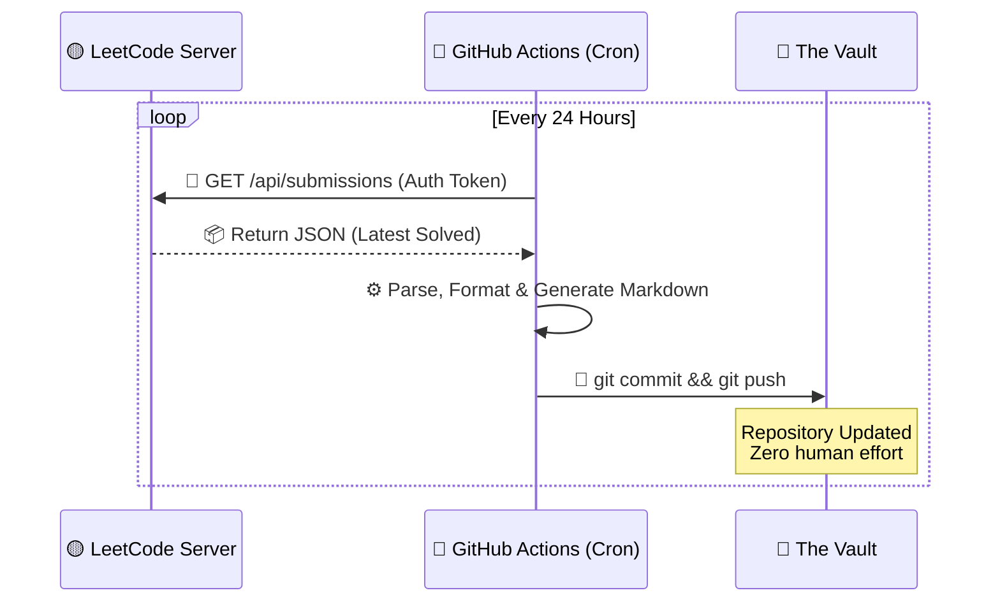
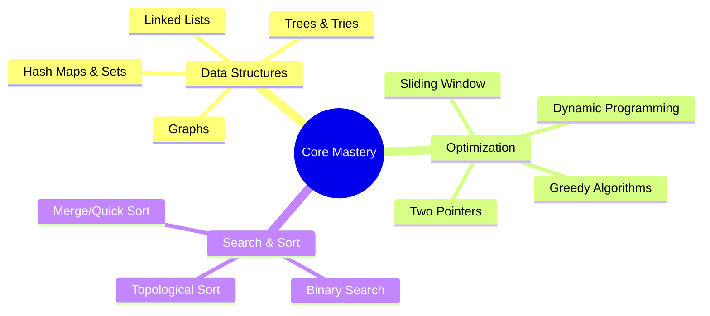
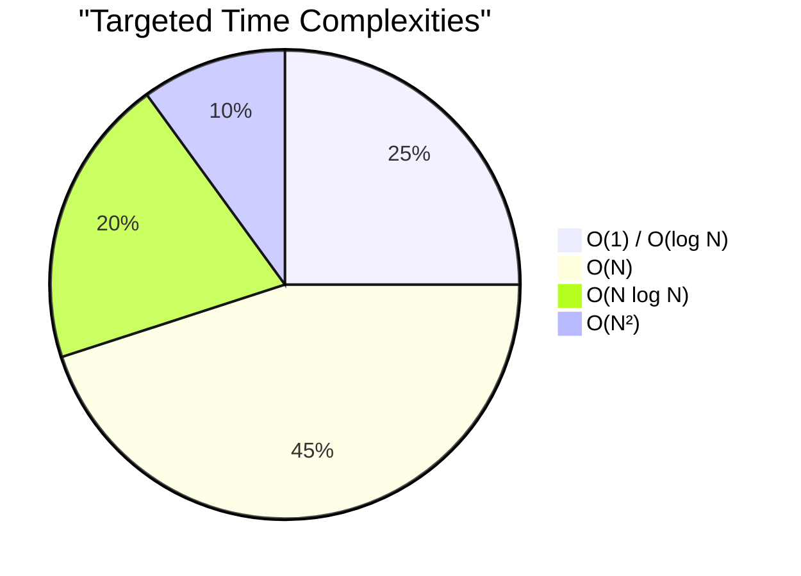
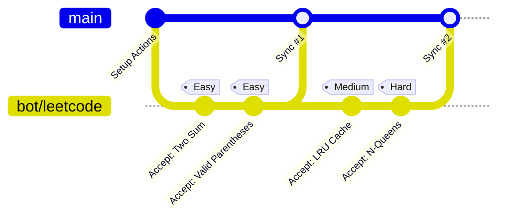

<div align="center">


<a href="https://leetcode.com/u/5VPjMsfuqV/">
  
</a>

<br/>

[](https://leetcode.com/u/5VPjMsfuqV/)
[](https://github.com/AyushSingh360/algorithm-arsenal/actions)
[](#-tech-stack)

<br/>

<a href="https://leetcode.com/u/5VPjMsfuqV/">
  
</a>

</div>

---

### 🚀 `< System.Overview />`

Welcome to the **Vault**. This isn't just a repository; it's an automated, self-updating timeline of my algorithmic journey. Every time a problem is conquered on LeetCode, a serverless pipeline instantly pulls the optimal solution, formats it, and injects it directly into this codebase. Zero manual intervention. Maximum efficiency.

<br>

<div align="center">
  
| ⚡ **Speed** | 🧠 **Complexity** | 🏗️ **Architecture** |
| :---: | :---: | :---: |
| Sub-millisecond Execution | O(1) State of Mind | Fully CI/CD Automated |

</div>

<br>

### 🧬 `< Automation.Matrix />`



<br>

### 🕸️ `< Algorithmic.Skill_Tree />`

A dynamic mapping of the core competencies being trained and cataloged within this repository.



<br>

### 📊 `< Complexity.Distribution />`

Conceptual breakdown of optimal solution approaches targeted in this archive.



<br>

### 🌿 `< Version_Control.Topology />`

How the automated bot interacts with the Git history upon solving challenges.



<br>

### 🗄️ `< Data.Structures />`

The archive is meticulously sorted for rapid O(1) retrieval.

<details open>
<summary><b>📂 Click to Expand Directory Tree</b></summary>
<br>

```bash
root@leetcode-vault:~# tree -L 2
.
├── ⚙️ .github/
│   └── 🤖 workflows/           # CI/CD Sync Engine
├── 🧠 leetcode/                # The Algorithm Core
│   ├── 🟢 Easy/                # Warm-ups & Fundamentals
│   ├── 🟡 Medium/              # Logic & Data Structures
│   └── 🔴 Hard/                # Advanced Optimization
└── 📜 README.md                # System Documentation
```
</details>

<br>

### 💻 `< Tech.Stack />`

<table align="center">
  <tr>
    <td align="center" width="96">
      
      <br>C++
    </td>
    <td align="center" width="96">
      
      <br>Python
    </td>
    <td align="center" width="96">
      
      <br>Java
    </td>
    <td align="center" width="96">
      
      <br>JavaScript
    </td>
    <td align="center" width="96">
      
      <br>Actions
    </td>
  </tr>
</table>

<br>

### 📡 `< Establish.Connection />`

Let's collaborate on system design, competitive programming, or next-gen tech.

<p align="center">
  <a href="https://leetcode.com/u/5VPjMsfuqV/">
    
  </a>
  <a href="https://github.com/AyushSingh360">
    
  </a>
</p>

---

<p align="center">
  
</p>
<p align="center">
  <code>System.exit(0); // See you in the next commit</code>
</p>
